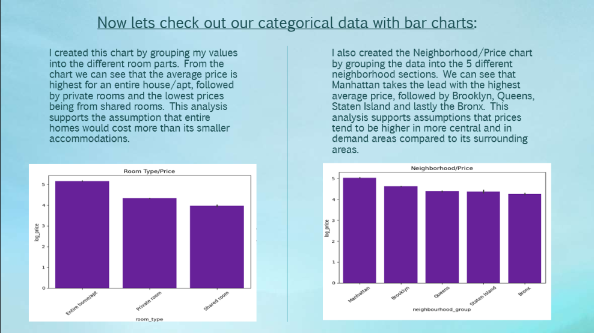

# New York Airbnb Data Analysis

Exploratory data analysis of New York Airbnb listings using Python, Pandas, and data visualization to examine pricing patterns across neighborhoods and room types.

## Project Goal

The goal of this project was to explore relationships within the Airbnb dataset and identify factors that may influence listing prices.

## Data Preparation

The dataset was reduced to the fields required for analysis, then cleaned, structured, and formatted for exploration.

Key preparation steps included:

- Selecting relevant features
- Cleaning and formatting data
- Checking distributions with boxplots and histograms
- Applying a log transformation to highly skewed data to reduce the influence of extreme values

## Exploratory Analysis

Visualizations such as scatterplots and bar charts were used to investigate relationships between listing characteristics.

The analysis focused on identifying patterns related to:

- Listing price
- Neighborhood
- Room type
- Other selected listing features

## Key Findings

The analysis did not identify strong relationships between all of the selected variables.

However, clearer pricing patterns were observed across:

- Neighborhoods
- Room types

These findings suggested that location and accommodation type were more useful for explaining price differences than some of the other variables explored.

## Tools Used

- Python
- Pandas
- Matplotlib / Seaborn
- Jupyter Notebook

## Presentation

A short PowerPoint presentation was also created to summarize the analysis process, findings, and personal reflection.
